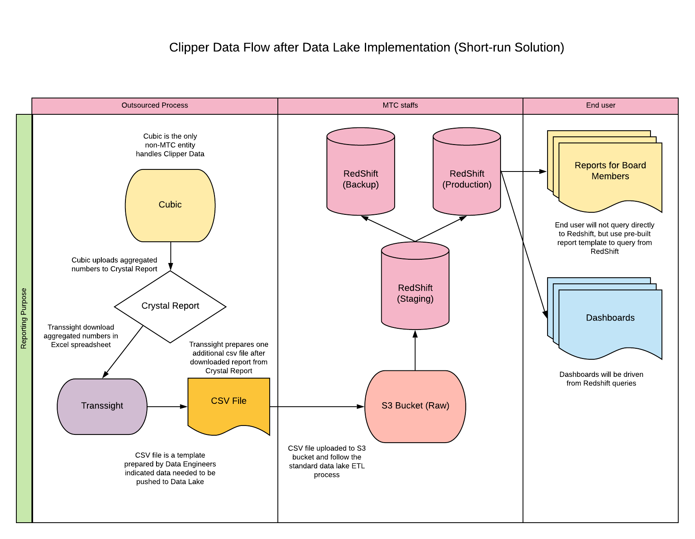
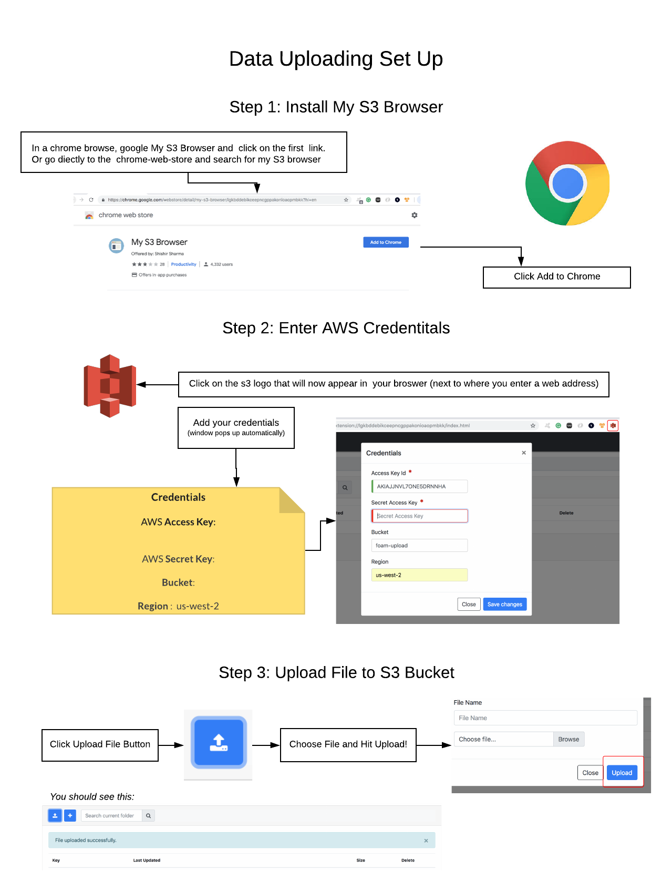

# Data Lake
The MTC Data Lake is an iniative that seeks to support a single point of access to key datasets that support the work of the Metropolitan Transportation Commission and Association of Bay Area Governments.

The MTC Data Lake is an initiative that seeks to support a single point of access to key datasets that support the work of the Metropolitan Transportation Commission and Association of Bay Area Governments.
The Data Lake is a system of Amazon s3 buckets and an Amazon Redshift data warehouse.  The s3 buckets that will allow data from various sources in the agency to be automatically uploaded to the redshift database which will serve as a single source of truth for the agency. We are in the process of working with data stewards across the agency to integrate their datasets into the Data Lake.
 
To make the data uploading as seamless and low burden as possible, we have devised the following setup for data stewards to upload their data to the s3 buckets.   Each time their dataset is updated, data stewards would simply need to add the new data to their bucket.  We would then use data wrangling tools like Trifecta to migrate the database.

In addition to transferring datasets from data stewards, we would also need to transfer data from different databases that currently exist at the MTC.  We have experimented with using data wrangling tools like Trifacta as well as writing our own Python script.  We also created an Electronic Payments Dashboard we are creating using the Data Lake.

In this repo we’ve included:
* [Documentation for the Data Lake](/data-lake/documentations)
* [Python ETL Script](data-lake//python-etl)
* [Electronic Payments Dashboard Documentation](/data-lake/eps-dashboard)

In the future, the Data Lake will look like this:

The process for Data Stewards to upload their data looks like this:

