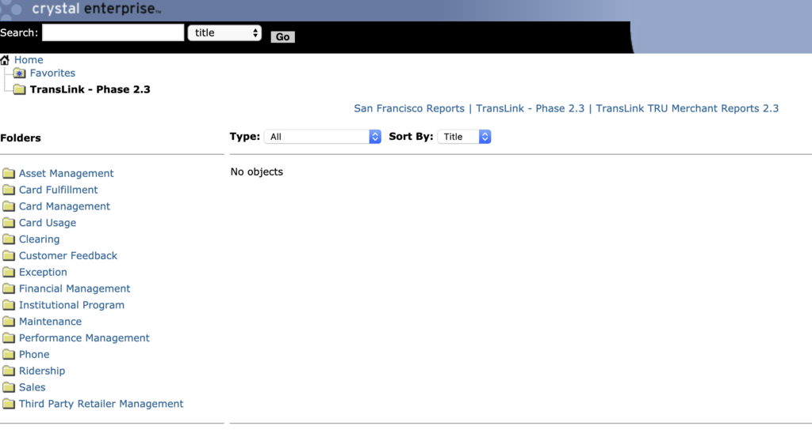

# Clipper Data Transfer and ETL Set up
Quinn Keck and Jacques Sham 

## Background

This documentation outlines the plan to transfer the Clipper data from Clipper Data Store to the Data Lake on Redshift, and the set up of ongoing ETL process to upload the clipper data to the Data Lake moving forward. The goal is to centralize Clipper data and thus to develop dashboard or tools for reporting and analysis. 

## Persona
Cubic: The consultant and data steward of Clipper. Cubic handles all Clipper daily operations for MTC and periodically send Clipper data to MTC. Terry Smith is contact person.
 
Data Engineers: Kearey Smith and USF interns, including Jacques Sham, Anastasia Keck
 
EPS staffs: EPS staffs, including Lysa Hale, Mike Lee, Ed Meng

## Tools
Data Clipper Store - MS SQL 
Data Lake - AWS S3, AWS Redshift 
ETL - Trifacta, Matillion 

## Implementation Before Data Lake Project
After the Clipper data is generated in Clipper operators, the data is store in XML format and be sent to Cubic's operational data store, where Cubic only store the data up to 1 year. After Cubic transform the data in tabular format, the data is sent to the Clipper Data Store and Crystal Report. Crystal Report is the reporting software which the EPS staffs obtain the data from. The reports generated from Crystal Report is too detail and in PDF that EPS staffs do not find it useful or any way to aggregate the numbers for reporting. Crystal Report does not provide dashboard or any dynamic functions for us to build a dashboard from it.
 

Crystal Report was selected to report Clipper data in MTC was unclear as this is the decision made in 90's and the fact that most of the transit operator use Crystal Report for reporting purpose. The flexibility of Crystal Report was little as it only has pre-built reports. In the below screenshot Figure 1 is the main page of Crystal Report; the folders on the left show all categories of pre-built reports you may look at.
 

