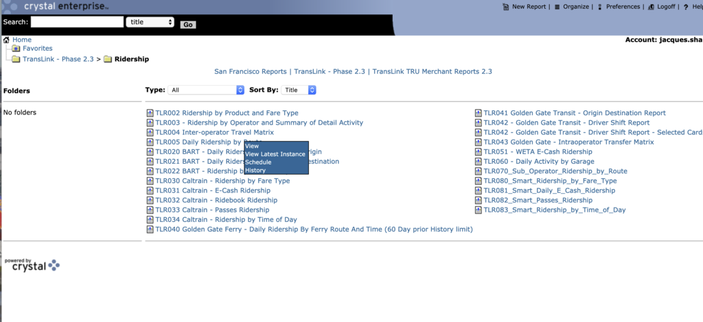
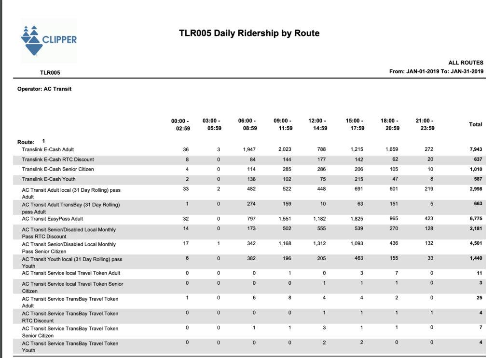
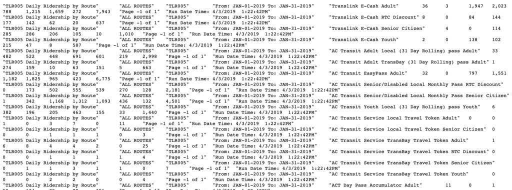

# Clipper Data Transfer and ETL Set up
Quinn Keck and Jacques Sham 

## Background

This documentation outlines the plan to transfer the Clipper data from Clipper Data Store to the Data Lake on Redshift, and the set up of ongoing ETL process to upload the clipper data to the Data Lake moving forward. The goal is to centralize Clipper data and thus to develop dashboard or tools for reporting and analysis. 

## Persona
Cubic: The consultant and data steward of Clipper. Cubic handles all Clipper daily operations for MTC and periodically send Clipper data to MTC. Terry Smith is contact person.
 
Data Engineers: Kearey Smith and USF interns, including Jacques Sham, Anastasia Keck
 
EPS staffs: EPS staffs, including Lysa Hale, Mike Lee, Ed Meng

## Tools
Data Clipper Store - MS SQL 
Data Lake - AWS S3, AWS Redshift 
ETL - Trifacta, Matillion 

## Implementation Before Data Lake Project
After the Clipper data is generated in Clipper operators, the data is store in XML format and be sent to Cubic's operational data store, where Cubic only store the data up to 1 year. After Cubic transform the data in tabular format, the data is sent to the Clipper Data Store and Crystal Report. Crystal Report is the reporting software which the EPS staffs obtain the data from. The reports generated from Crystal Report is too detail and in PDF that EPS staffs do not find it useful or any way to aggregate the numbers for reporting. Crystal Report does not provide dashboard or any dynamic functions for us to build a dashboard from it.
 

Crystal Report was selected to report Clipper data in MTC was unclear as this is the decision made in 90's and the fact that most of the transit operator use Crystal Report for reporting purpose. The flexibility of Crystal Report was little as it only has pre-built reports. In the below screenshot Figure 1 is the main page of Crystal Report; the folders on the left show all categories of pre-built reports you may look at.
 

Figure 1

  
If you download the report from Crystal Report, you will go to the report and hit "Schedule" (When you hit "View" or "View Latest Instance" give you a blank gray page). Please see Figure 2.

Figure 2
  

Figure 3
  
Once you hit schedule, you are able to select date range and output format. Note that you are only allow to select report up to 90 days prior. The useful report format is in PDF; although it is possible to export to TSV, the format is not in a desired tabular format that could be easily to ETL from such TSV file to push to relational database. Figure 4 is the screenshot of the report in PDF format and Figure 5 is the screenshot of the report TSV format. You may see the format TSV format is not in tabular form because there is a column header associated with every row that means the file is downloaded to be the order of header, observation, header, observation...instead of having header, and all observations.

Figure 4

Figure 5
  
Due to the given constraints, it makes it harder to ETL clipper data to Redshift. 
Prior to the Data Lake Implementation, the flow of reporting Clipper data is below. 

Figure 6
 
Based on the data flow before implementing Data Lake, Cubic is responsible to upload the data to: 
1) Crystal Report 
2) Clipper Data Store 

on monthly basis. The functionality of those are:  
1) Crystal Report 
Crystal Report is the an outdated online platform that users may download the aggregated numbers from. MTC outsourced the work to Transsight to download the numbers need for reporting and put the numbers into Excel spreadsheet, then send it to MTC EPS staffs on a monthly basis. The process and data selection are set up about 10-20 years before 2019, no one understand why and how the reporting process and system are set up in this way. However, the numbers produced in Crystal Report is the official record to use for reporting purpose, confirmed by Ed Meng. 
The contact person of each stakeholder: 
MTC: Lysa Hale, Mike Lee, Ed Meng 
Transsight: Gopi Purohit 
Cubic: Jeffrey Wei 
2) Clipper Data Store 
The operational data is sent to Clipper Data Store in monthly basis, but updated data made from Cubic would not be updated in Clipper Data Store; at the same time, there are transaction data entries are missing in Clipper Data Store, such as credit card transactions, because it was set up in this way previously between MTC and Cubic while no one in MTC now knows why it was set up in this way. 

The Clipper data sent to MTC has two purpose: 
1) Reporting Purpose 
Cubic is responsible to upload the accurate data onto Crystal Report and provide the data to EPS staffs for reporting to board members. Gopi from Transsight would download the data in reporting format in PDF and Excel files and upload to EPS' Box account, thus Lysa could able to utilize the data on Excel files for reporting to Board members. "1_Operations Report Data_12172018_charts (version 1).xls" is the Excel files that Lysa is relying on for her reports that provides that detail level of data, such as ridership per operator,  before aggregated to "Tabulation" tab which is the tab displaying the aggregated numbers Lysa need for reporting. However, Quinn and Jacques have spent approximately 4 practicum work days tried to tie the numbers between SQL query from Clipper Data Store and the numbers on such Excel file and were not able to get an identical numbers in between. In the meeting with Mike Lee and Ed Meng, Ed Meng mentioned that the data in Clipper Data Store is not accurate and MTC will stick with Crystal Report numbers for reporting purpose.
  
2) Analytics Purpose
The Clipper Data Store data is meant for analytics purpose because the Clipper Data Store data is no the same as the raw data in Crystal Report. There are two major reasons to that: 
i) Cubic did not transfer the full data set in sfoAddVauleTransactions and sfoToTAddValueTransactions tables: The credit card transactions are missing, but there is no clear reason why Cubic not providing these transactions.  
ii) Cubic do not update the data set in Clipper Data Store. If there is changes to the data (One Possible reason due to operator sent the data late) after Cubic send the data to Clipper Data Store, no change will be made.  

Also note that, Caltrain does not require monthly pass travelers to tag Clipper every trip. The ridership numbers reported to board member or analytics rely on a formula to adjust from the ridership provided  by Crystal Report. 

## Goal

The goal of this task includes: 
1) Transfer the existing data from Clipper Data Store (2013-2018) to Data Lake 
2) Set up a procedure to have Cubic provide monthly raw data directly to Data Lake and build a pipeline to transform the data into data warehouse 
3) Design and Construct schema and table structure to improve performance for dashboard 

## Transferring existing data
The data from Clipper Data Store between 2013 and 2018 was the first batch of data to be imported into Redshift. The process was using Trifacta as ETL tool to transfer the data. However, Trifacta by default is only able to handle up to 150 GB table. The data between 2013 and 2018 contains about 1.8 billion rows that Trifacta was overflowed and not able to handle the transfer. If the data size is consistently large, it is advised to upgrade the memory size of Trifacta or switch to Matillion. However, since it is only an one time operation, we do not need to have larger node in Trifacta for the regular operation unless the transfer transaction is handling more than 150 GB data.

## Preprocessing
Two proposed strategies to improve data lake performance for dashboard is to create views on data warehouse and create a star-schema structure database. Understanding the columns structures are required for both of the strategies. 
Prior to implementing the data lake project, Lysa has one monthly report, Clipper Update, which obtain the data from Crystal Report. The report includes: 
* Average Weekday Ridership
* Fee-Generating Transactions
* Unique Cards Used
* Active Card Accounts
* Settled Transit Operator Revenue
* Customer Service Representative calls
* Website Traffic: Unique Visitors and Website Visits
  

The First task of preprocessing is to figure out which columns are useful for dashboard to replace Crystal Report or frequently query in order to improve performance. Lysa has provided a spreadsheet, 1_Operations Report Data_12172018_charts (version 1), which the name is the same every month. 