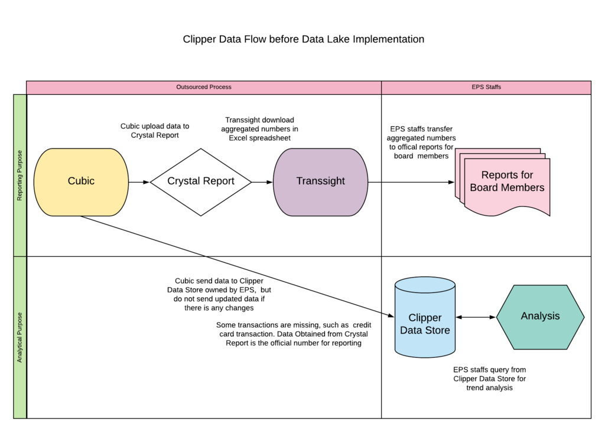
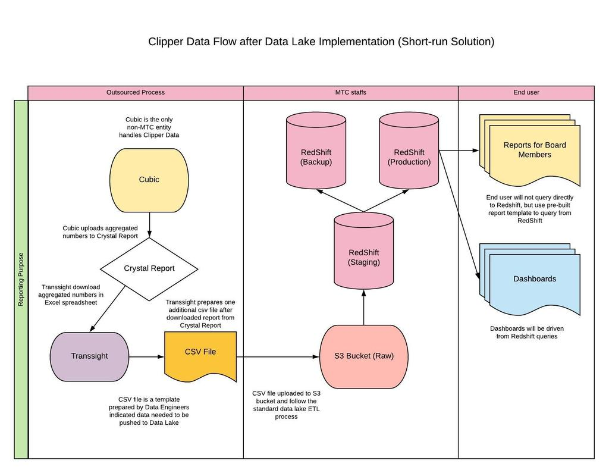
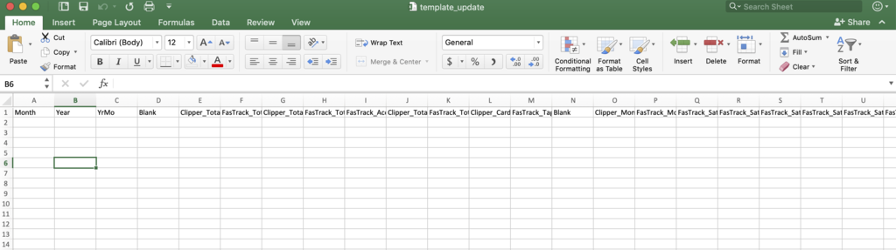
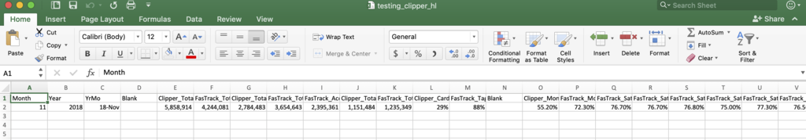

# Clipper Reporting Data ETL
Quinn Keck and Jacques Sham 

## Background
Quinn and Jacques

This documentation outlines the plan to transfer the Clipper reporting data from consultant to the Data Lake on Redshift, and the set up of ongoing ETL process to upload the clipper data to the Data Lake for short term. The goal is to set up a ETL work flow for the preparation of building dashboard for Clipper monthly reports. 

In the current structure, Cubic is the consultant who handles the operations of Clipper and collect the data on Clipper transactions. Cubic is responsible to provide accurate data for MTC for reporting and uploads the accurate aggregated data to Crystal Report. Gopi Purohit from Transsight is responsible to download and organize the reporting data on Excel and send to Lysa Hale in MTC. The work flow is shown below:

Figure 1 

Note that transaction data from Cubic are pipelined to two channels: Crystal Report and Clipper Data Store. Clipper Data Store stores the raw data of Clipper transactions but it was a business decision that Cubic is not providing credit card transactions. Since the data set in Clipper Data Store is not a full version, we cannot use the data in Clipper Data Store to build a dashboard for reporting purpose. Therefore, we can only rely on data from Crystal report. 

In the long run, the optimal data work flow should work as below:

Figure 2 

However, MTC have contract with both Cubic and Transsight, the optimal data work flow could not be implemented because we are not able to change the existing reporting structure in the short run. The suggested work flow should work as below: 

Figure 3 

## Persona
Cubic: The consultant and data steward of Clipper. Cubic handles all Clipper daily operations for MTC and periodically send Clipper data to MTC. Terry Smith is the contact person. 

Transsight: The consultant to generate reports and send to MTC. Gopi Purohit is the contact person. 

Data Engineers: Kearey Smith and USF interns, including Jacques Sham, Anastasia Keck
 

EPS staffs: EPS staffs, including Lysa Hale, Mike Lee, Ed Meng
 

## Tools
S3 client - My S3 Browser 
Data Lake - AWS S3, AWS Redshift 
ETL - Trifacta, Matillion 

## CSV Template
The screenshot of the CSV template version 1, named "template_update.csv", is:

Figure 4 

The template consists of the following columns: 
* Month,Year,YrMo,Blank,Clipper_Total_Card_in_Circulation

* FasTrack_Total_Tags_in_Circulation,Clipper_Total_Card_Active,FasTrack_Total_Tags_Active,FasTrack_Accounts,Clipper_Total_Unique_Cards,FasTrack_Total_Unique_Tags

* Clipper_Card_AutoLoads,FasTrack_Tags_AutoLoads,Blank,Clipper_Monthly_Saturation,FasTrack_Monthly_Saturation,FasTrack_Saturation_1st_Tuesday,FasTrack_Saturation_2nd_Tuesday,FasTrack_Saturation_3rd_Tuesday

* FasTrack_Saturation_4th_Tuesday,FasTrack_Saturation_5th_Tuesday,FasTrack_Market_Sat_Weekly_Avgerage,Blank,Clipper_Fare_Payment_Transactions,Clipper_Add_Value_Payment_Transactions

* Clipper_Total_Transactions,FasTrack_Total_Transactions,FasTrack_Bridge_Only_Transactions_SFO,FasTrack_Bridge_Only_Transactions_I-680s,FastTrack_Bridge_Only_Transactions_SR-237,FasTrack_Bridge_Only_Transactions_I-580,FasTrack_Bridge_Only_Transactions_I-680
* Clipper_Revenue_By_Channel_AutoLoad_AddValue,Clipper_Revenue_By_Channel_Retailers,Clipper_Revenue_By_Channel_Ticket_Machines,Clipper_Revenue_By_Channel_Ticket_Office_Terminal,Clipper_Total_Revenue,FasTrak_Total_Revenue,Blank,Ciipper_Total_Calls,FasTrack_Total_Calls
* FasTrak_Abandoned_Calls_Number,FasTrak_Abandoned_Calls_Percent,Clipper_CRS_Calls_Handeled,FasTrak_CRS_Calls_Handeled,Clipper_IVR_Calls_Handled,FasTrak_IVR_Calls_Handled

* Clipper_Total_Calls_to_CSC,FastTrak_Total_Calls_to_CSC,Clipper_Total_CSC_Calls_to_CSR_Percent,FasTrak_Total_CSC_Calls_to_CSR_Percent,Clipper_Total_CSC_Calls_to_IVR_Percent

* FasTrak_Total_CSC_Calls_to_IVE_Percent,FasTrak_Percent_Calls_Done_in_60s,FasTrak_Percent_Calls_Done_in_180s,FasTrak_Average_Delay_Time_Seconds,FasTrak_Average_Talk_Time_Time_Seconds
 
 
that the columns order is identical to the format of "Copy of Copy of Monthly FasTrak-Clipper Stats for Mgmt CH2M May 2016 v2-01.xlsx", which looks like this:

Figure 5 

To prevent the confusion Gopi would have in the process, we decide the template that Gopi can be copy and paste from "Copy of Copy of Monthly FasTrak-Clipper Stats for Mgmt CH2M May 2016 v2-01.xlsx" and paste to "template_update.csv" and take away all format and colours.
 

The ideal file would have look like this: 

Figure 6 

