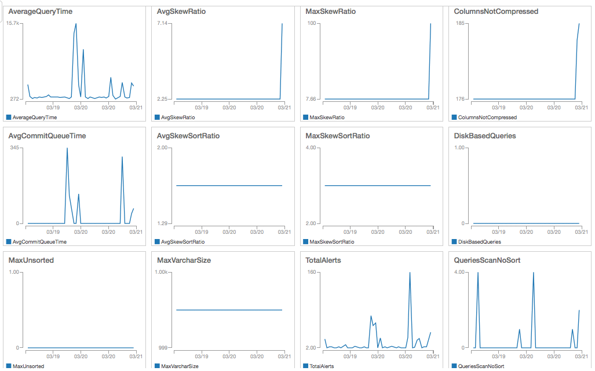
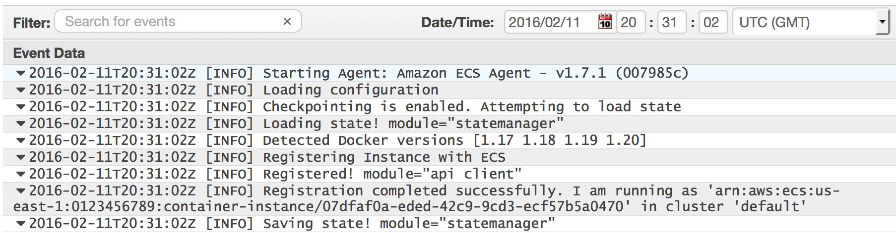
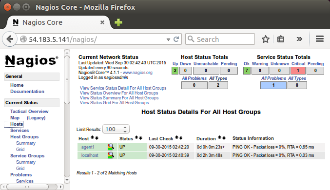
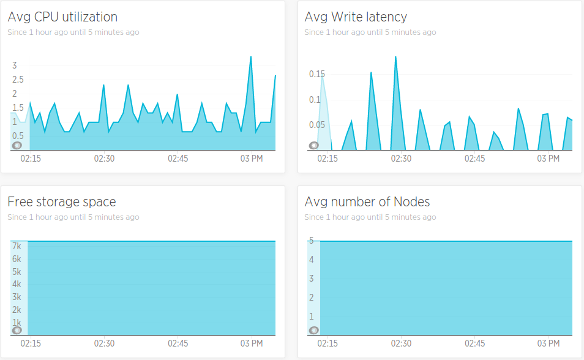
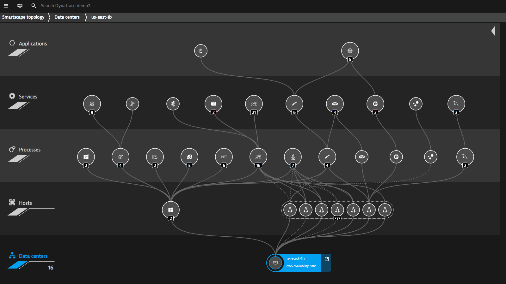

# Tools for Data Lake Logging and Reporting
Quinn and Jacuqes
  

There are 4 potential tools are Data Lake logging and reporting in addition to dashboard on MySQL.

### AWS CloudWatch
* Native to AWS
* Dashboard feature provides a lot of built-in metrics useful to other AWS service, including Redshift
* Allow to set alarm for based on metrics value
* No default or suggestion on setting alarm or building dashboard
* Very low cost if AWS customer: 
* $3 per dashboard per month and fraction of dollar of other base charge per month
* Allow to do logging analytics and visualization in the same platform

 

 

### Nagios
* Well trusted in industry for years
* Use C/Python to manage AWS plugins
* Old UI

* $2000 per year

* Hard to set up or add user

* Reports are not easy to deploy

 

### New Relic
* Most well-known in industry for years
* Many plugins, including the ones for AWS Redshift, is not supported by New Relic
* Pricing range from $10-100 per month per host
* Supportive reputation
* Takes long time to learn

 

### Dynatrace
* Relatively new company, provide better UI than Nagios and New Relic
* Easy Dashboard creation
* Takes long time to learn
* Pricing starting from $216 per month per host

 

## Suggestion
Nagios is a well trusted monitoring platform for long years and is well designed for monitoring database with plugins. Nagios has plugins for S3 and Redshift but the UI is old and require C/Python to maintain the plugins, and costs $2000 per year to operate. New Relic and Dynatrace are newer companies provide monitoring service. They provide service to monitor S3 and Redshift but their platform focus more on monitoring apps and other non-database applications. They both cost about $100-200 to operate per month, or $1200-2400 per year. 
  

AWS CloudWatch is native to S3 and Redshift and provide a lot of built-in dashboard and metrics for monitoring other AWS functions, including S3 and Redshift. CloudWatch charges by number of dashboard per month and overall extremely inexpensive. Because of the pricing of CloudWatch and highly integrated with S3 and Redshift, I would recommend AWS CloudWatch for Data Lake Logging and Reporting tool.