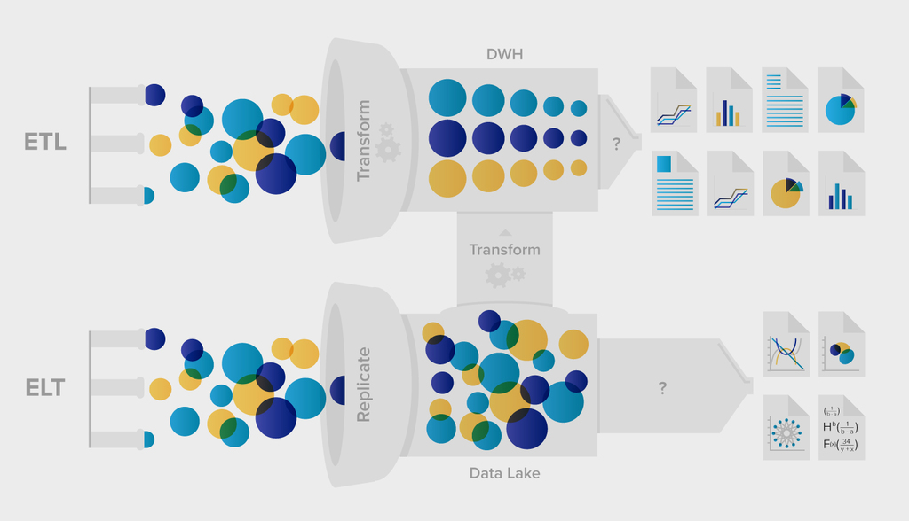

# Research on Typical Requirements for a Data Lake Implementation
Quinn and Jacques

## What is a data lake?
[Reference](https://www.xplenty.com/blog/etl-vs-elt/)
Data lake ingests unstructured data and does transformations (ELT, Extract Load Transform) after data is stored (unlike Data Warehouse where data is ETL).

## Requirements for Data Lake (High Level)
https://www.splicemachine.com/7-requirements-operationalize-data-lakes/
1. Ingestion
2. SQL
3. Tables versus Files
4. Analysis
5. Concurrency
6. Backup and Restore
7. Updates

Applied for Preview of AWS Lake Formation Service - [AWS Documentation](https://aws.amazon.com/lake-formation/)

AWS Glue will generate ETL code in Scala or Python to extract data from the source, transform the data to match the target schema, and load it into the target - [AWS Glue](https://aws.amazon.com/glue/) 

[AWS Big Data Blog](https://aws.amazon.com/blogs/big-data/build-a-data-lake-foundation-with-aws-glue-and-amazon-s3/)
 
[Big Data Management](https://www.coursera.org/lecture/big-data-management/understanding-data-lakes-1Q6nE)

Notes:
* Data Lake - data stored in original form - "large body of water in more natural state"
* "schema-on-read" --  Load data from source -> Store Raw data -> Add data model on read 
* "schema-on-write" --  transform structure before load
* Datawarehose - stores data in hierarchal storage system
* Data lake - Object Storage (flat file with unique identifier)
* Each data is tagged with meta data tags
* Transforms data when needed
 

[Reference](https://www.dataversity.net/data-warehouse-vs-data-lake-technology-different-approaches-managing-data/)

## AWS Requirements
[AWS Data Lake Documentation](https://aws.amazon.com/big-data/datalakes-and-analytics/)
* Object Storage - S3
* Backup and Archive
* Data Catalog -  AWS Glue

## Analytics 
* Big Data Processing - Amazon EMR
* Data Warehousing - Amazon Redshift

[Reference](https://www.big-data-europe.eu/wp-content/uploads/D3.5-Big_Data_platform_requirements_architecture_and_usage.pdf)

 
* Includes hardware requirments, nodes etc
* Data Ingestion and Persistence
* Data Access
