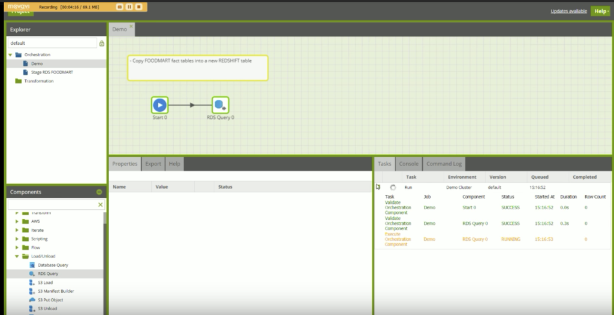

# ETL Tools work with AWS Redshift
Quinn and Jacques
 
 
Including Trifacta, there are 5 ETL Tools are potentially MTC may choose from for ETL data from AWS S3 to AWS Redshift.

### Stitch
* Good UI and easy to use
* Fast
* Great for replication
* Great for extracting from API
* Have system log
* Synchronize from S3 in every very short period, longest every 24 hours 
* No Transformation
* Only do good when uploading data to Redshift without process or transformation
* Good for visualization
* Not expensive – $1000/year to 5 million rows and 7 days of system log retention

[Official Website](https://www.stitchdata.com/)

 

Demo on [YouTube](https://youtu.be/mcgeYd1WhaM)

 

 

### FiveTran
* Similar to Stitch with better UI and more destination
* Great for visualization and analytics
* No manual transformation, transformation be automatically done to meet destination format requirement
* Pricing similar to Stitch
* Only do good when uploading data to Redshift without process or transformation

[Official Website](https://fivetran.com/)

 

Demo on [YouTube](https://youtu.be/wiwabNQzRJc)

 

### AWS Glue
* Native to S3 and Redshift
* Use Python for pipeline, Lambda for triggering an update (AWS able to generate code in high level)
* Able to schedule and edit python code    

### Trafacta
* Not easy to learn at the first place
* Notify Admin to connect S3 buckets

### Matillion
* App provider partner with AWS, design for Redshift
* Design for huge size of data set
* Able to transform data in high level, function like Trafacta
* Pricing at $1.37/hour, about $1000 per month
 

Very flexible ETL process - [Official Website](https://www.matillion.com/etl-for-redshift/)

 

Document to read data from S3 - [Documentation](https://redshiftsupport.matillion.com/customer/portal/articles/2042349?b_id=8915)

 

[Reference](https://iolap.com/2016/05/18/is-cloud-based-matillion-etl-the-answer-for-redshifts3-integration/)

 

[Demo](https://www.youtube.com/watch?v=al3waLlC-L0)

 

## Suggestion
creating dashboard from real-time data without having any transformation. Those platforms are not suitable for Data Lake project because data transformation is needed before pushing the data from S3 to RedShift. 
  

Trifacta provides good UI for users to do ETL from S3 to Redshift, it does not require any coding to operate. It requires users to take some time to learn at the beginning. The downside of Trifacta is that Trifacta is not able to fully implement with S3, ie, every time user create a new S3 bucket, it requires users to notify the Trifacta admins to connect S3 bucket with Trifacta before users building new work flow with the new S3 bucket. The alternative to Trifacta is Matillion. Matillion is similar to Trifacta and is an partner with AWS. Matillion does not seem to have the same problem as Trifacta for notifying admin every time create new S3 bucket, and thus Matillion is a good alternative from Trifacta.
  

AWS Glue is potentially a good alternative as Glue is native to S3 and Redshift. It can be called with the same account in AWS that it is more manageable and easy to implement with S3 and Redshift. However, the downside is that Glue required AWS Lambda to operate, thus Python is required. Since Trifacta and Matillion is easier to be trained to use than using AWS Glue with Python, and easier to maintain too. I do not recommend to use AWS Glue unless any transformation that Trifacta and Matillion are not capable is need to be done 
