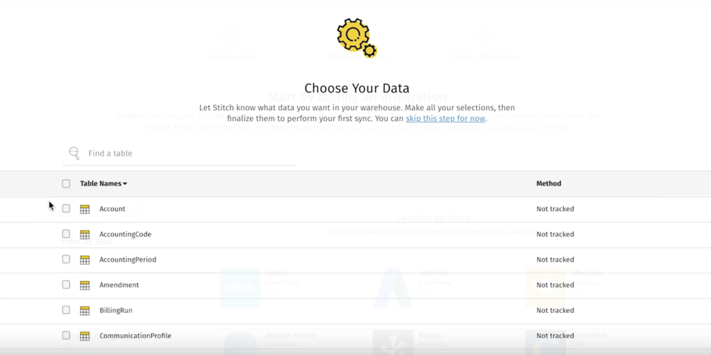
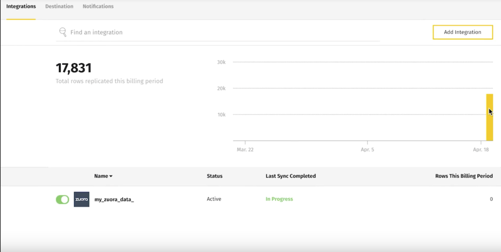
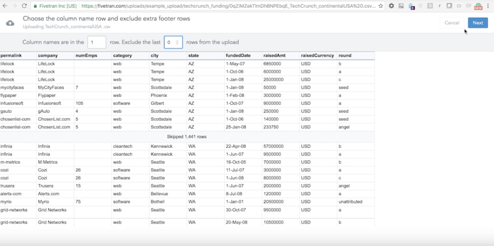

# ETL Tools work with AWS Redshift
Quinn and Jacques
 
 
Including Trifacta, there are 5 ETL Tools are potentially MTC may choose from for ETL data from AWS S3 to AWS Redshift.

### Stitch
* Good UI and easy to use
* Fast
* Great for replication
* Great for extracting from API
* Have system log
* Synchronize from S3 in every very short period, longest every 24 hours 
* No Transformation
* Only do good when uploading data to Redshift without process or transformation
* Good for visualization
* Not expensive – $1000/year to 5 million rows and 7 days of system log retention

[Official Website](https://www.stitchdata.com/)

 
Demo on [YouTube](https://youtu.be/mcgeYd1WhaM)

### FiveTran
* Similar to Stitch with better UI and more destination
* Great for visualization and analytics
* No manual transformation, transformation be automatically done to meet destination format requirement
* Pricing similar to Stitch
* Only do good when uploading data to Redshift without process or transformation

[Official Website](https://fivetran.com/)

 
Demo on [YouTube](https://youtu.be/wiwabNQzRJc)

