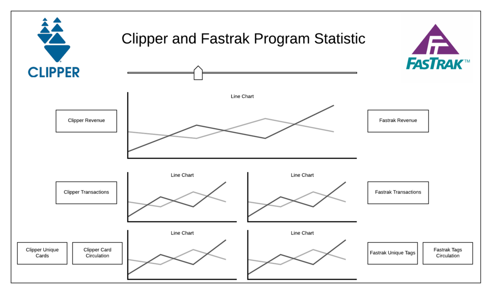

# EPS Reporting Dashboard

## Background
Quinn and Jacques
 
 
EPS staffs rely heavily on serial of static reports and Excel charts on reporting Clipper and Fastrak operation data but management would like to shift away from reports to a set of  interactive plots. After the data lake is implemented, this is the first project that data is driven from the data lake that the dashboard is relied on the data lake. 
 
 
Currently there are 3 documents that EPS staffs prepared to upper management and board of directors:
1. Final Clipper Update, MS word document
2. EP Monthly Memo, PDF
3. Electronic Payments, MS word document
 
 
Note: Figure 1-5 not available, please find the figures in the documentation in MTC Box.
 

## Persona

Cubic: The consultant and data steward of Clipper. Cubic handles all Clipper daily operations for MTC and periodically send Clipper data to MTC. Terry Smith is the contact person.
 
Data Engineers: Kearey Smith, Kaya Tollas and USF interns, including Jacques Sham, Anastasia Keck
 
EPS staffs: EPS staffs, including Lysa Hale, Mike Lee, Sarah Doggett
 

## Requirement for Dashboard
In general, the top 5 important KPI is to be included in the prototype dashboard are the following: 
* Revenue
* Fare-generating Transactions
* Circulation
* Unique cards/tags
* Total customer calls of Clipper and Fastrak
 
The 1st version of dashboard prototype looks like this:

Figure 6: The 1st version of dashboard prototype
 
 
There are some notes to the dashboard requirement. 
1. The Excel charts is not informative because the length of time interval is short so readers are not able to see the trend in the time series line chart. Longer length of time interval is helpful, aim to have 5 years. Therefore, having flexibility of time interval is great.
2. Visualization is better than having percent change in the Update.
3. The first phase of this project should focus on overall level, by operator is not important

## Data Pipelines
The dashboard requires the Clipper reporting data which relies from clipper.clipper_reporting table in lake in AWS Redshift. Each dashboard tool has its own requirement of connecting to AWS Redshift, in general, each dashboard tool requires AWS dashboard endpoint, port number, user name and password to connect. The ideal pipeline is to have the dashboard obtain data directly from AWS Redshift every time using the dashboard. The data is relied from on 1_Operations Report Data_12172018_charts (version 1).xls which is prepared by Gopi in Transsight. Sarah is the one who would be the data stewards in MTC.

## The Choices of Tools
There are 3 tools candidates to build on the dashboard. 
1. Google Data Studio
2. Tableau
3. Microsoft Power BI

## Google Data Studio
We did not choose Google Data Studio at the first place because of the following reason:
1. As of June, 2019, Google Data Studio is still at its beta version.
2. Lack of types of visualizations
3. Slow performance on querying from AWS Redshift
4. Hard to handle time series data (Hard to handle timestamp)
5. No dash line to help adjusting position
 
However, Google Data Studio could be a potential good tool because:
1. Very easy to host the dashboard online using Google
2. Easy text format

## Tableau
Quinn was assigned to build the dashboard with Tableau. Please see [Tableau EPS Dashboard](TableauEPSDashboard.md) for Documentation.

## Microsoft PowerBI
Jacques was assigned to build the dashboard with PowerBI. PowerBI was chosen as tool because MTC already has Microsoft license for each employee, so there is no extra cost to pay for this tool. Please see [EPSReportExecutiveDashboard](EPSReportingExecutiveDashboard_BI.md) for Documentation.